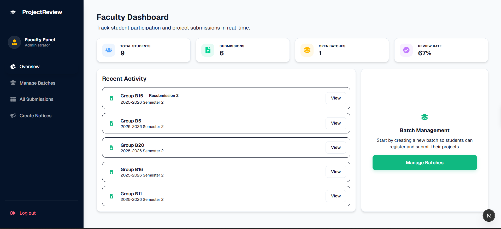
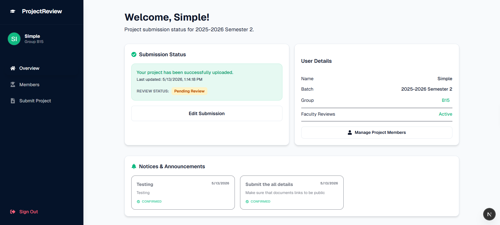

# Project Review System 🚀

A modern, robust, and highly transparent Project Submission and Review Management System built for educational institutions. This platform streamlines the workflow between students and faculty, ensuring that every iteration of a project is tracked, reviewed, and acknowledged.

## ✨ Key Features

### 👨‍🎓 For Students

- **Dynamic Dashboard**: View submission status, faculty feedback, and official notices at a glance.
- **Robust Submission Portal**: Upload core project files (Synopsis, Reports, Black Book, Poster) and phase-wise Review PPTs.
- **Screenshot Gallery**: Showcase project visuals with an interactive, expandable gallery.
- **Notice Acknowledgement**: Stay updated with batch-specific announcements and confirm receipt with a single click.
- **Resubmission Tracking**: Effortlessly re-upload projects after feedback; the system automatically resets status and tracks version history.

### 👨‍🏫 For Faculty (Admin)

- **Batch Management**: Organize students and projects by year, semester, and batch.
- **Advanced Submission Review**: A centralized table to view all submissions with "Accepted", "Under Review", and "Pending" statuses.
- **Resubmission Badging**: Instantly identify re-uploaded projects with "Resubmission X" badges.
- **Notice Management Portal**: Blast announcements to specific batches with built-in templates.
- **Acknowledgement Tracking**: See exactly which groups have read and confirmed your notices via paginated read receipts.
- **Live Activity Feed**: Monitor recent project updates in real-time.

## 🛠️ Tech Stack

- **Frontend**: [Next.js 14](https://nextjs.org/) (App Router), [Tailwind CSS](https://tailwindcss.com/)
- **Backend/Database**: [Firebase](https://firebase.google.com/) (Firestore, Authentication)
- **Media Storage**: [Cloudinary](https://cloudinary.com/) (Images & PDFs), [Firebase Storage](https://firebase.google.com/products/storage)
- **Icons**: [React Icons](https://react-icons.github.io/react-icons/)
- **Styling**: Modern Glassmorphism & Premium Dashboard Aesthetics

## 🚀 Getting Started

### 1. Clone the repository

```bash
git clone <repository-url>
cd project
```

### 2. Install dependencies

```bash
npm install
```

### 3. Environment Setup

Create a `.env.local` file in the root directory and add the following configurations:

```env
# Firebase Configuration
NEXT_PUBLIC_FIREBASE_API_KEY=your_api_key
NEXT_PUBLIC_FIREBASE_AUTH_DOMAIN=your_auth_domain
NEXT_PUBLIC_FIREBASE_PROJECT_ID=your_project_id
NEXT_PUBLIC_FIREBASE_STORAGE_BUCKET=your_storage_bucket
NEXT_PUBLIC_FIREBASE_MESSAGING_SENDER_ID=your_sender_id
NEXT_PUBLIC_FIREBASE_APP_ID=your_app_id
NEXT_PUBLIC_FIREBASE_MEASUREMENT_ID=your_measurement_id

# Cloudinary Configuration
NEXT_PUBLIC_CLOUDINARY_CLOUD_NAME=your_cloud_name
CLOUDINARY_API_KEY=your_api_key
CLOUDINARY_API_SECRET=your_api_secret

```

### 4. Run the development server

```bash
npm run dev
```

Open [http://localhost:3000](http://localhost:3000) with your browser to see the result.

## 📸 Project Preview

|          Admin Dashboard          |           Student Submission           |
| :--------------------------------: | :------------------------------------: |
|  |  |

📂 Project Structure

- `app/`: Next.js App Router pages and layouts.
- `components/`: Reusable UI components (Sidebar, Modals, etc.).
- `lib/`: Configuration files (Firebase, AuthContext) and utility types.
- `public/`: Static assets and screenshots.

## 📄 License

Distributed under the MIT License.

---

Built with ❤️ for improved academic transparency.
